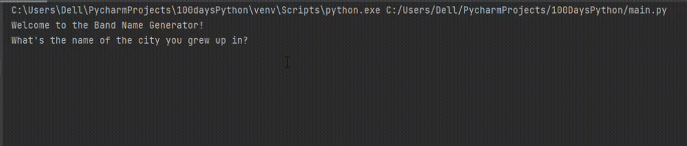

## Day 1

This is the first day of 100 days of python. It starts out with the basics. Using the print function, input function, concatenating strings and creating variables. 
The day's project was building a simple program that takes in the name of your city and pet, then suggests a band name for you.

## Band Name Generator

