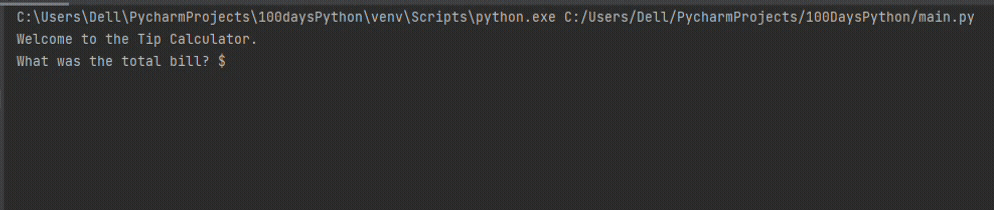

## Day 2

Day 2 was about understanding the data types in Python and how to manipulate strings.
The day's project was building a simple program that calculates the tip on a bill and splits it between the number of people.

## Tip Calculator

