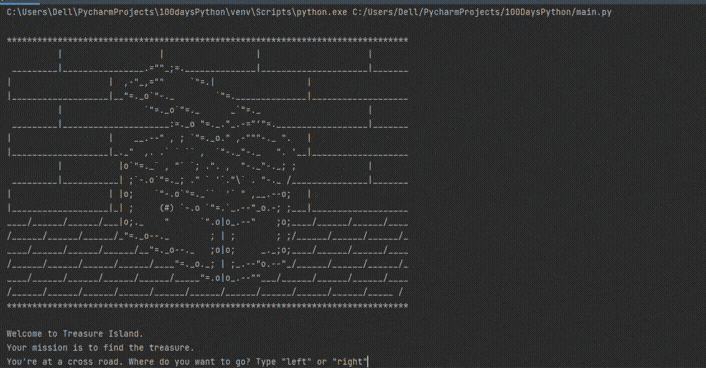

## Day 3

Day 3 deleves into control flow and logical operators. Learning how to use if/else statements and logical operators like and, or and not. 
The day's project was building a simple game that asks the player to make three set of choices to reach a treasure.

## Treasure Island

