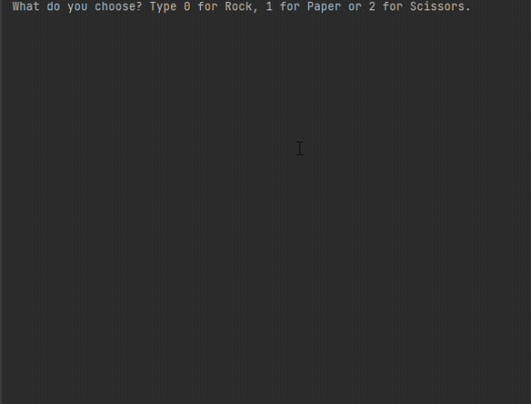

## Day 4

Randomisation and Python lists were covered on the fourth day. On this day, importing and using other modules was covered starting with the random module. Creating and manipulating python lists was also taught. 
Today"s project was building a rock, paper, scissors game played against the computer.

## Rock, Paper, Scissors Game

