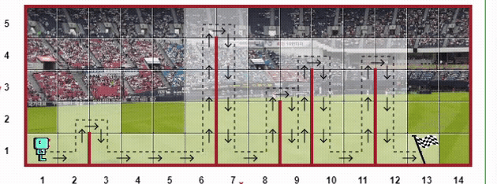

## Day 6

Functions and while loops were covered.
Reeborgs world was used to explain how to get fuctions to perform repeated code without having to wrote it out every single time.

## Reeborg World

