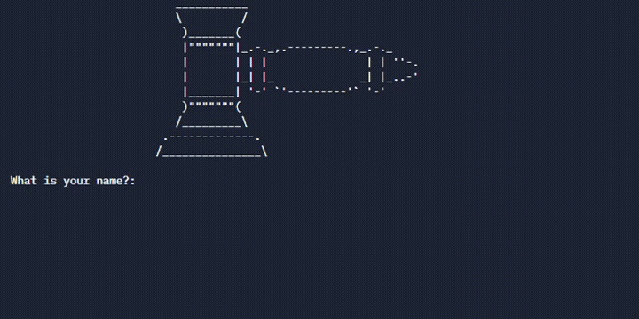

## Day 9

On day 9 we learn about dictionaries. How to create delete and manipulate dictionaries was covered. 
We also learn about nesting dictionaries.

The day's project was creating a silent auction program.

## Silent Auction

