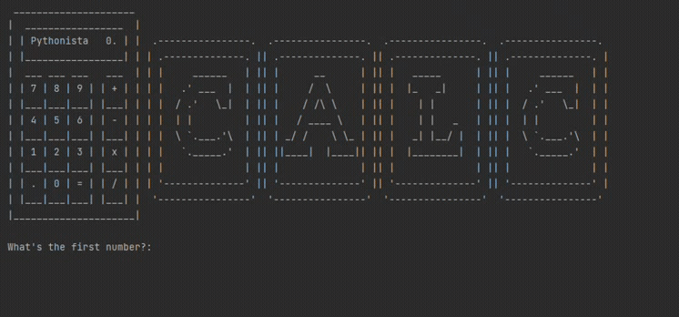

## Day 10

Day 10 covered funtions with output. We also learnt how to use docstrings to document what a function you created is supposed to do. Recursions in funtions was all covered.
The day's project was building a simple text based calculator app.

## Calculator

