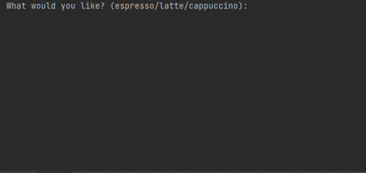

## Day 15

Day 15 project was building a virtual coffee machine in python. The machine has a limited amount of ingredient and inputting "report" shows it. If the ingredients are sufficient and you input the name of your coffee it gives it out.

## Coffee Machine

