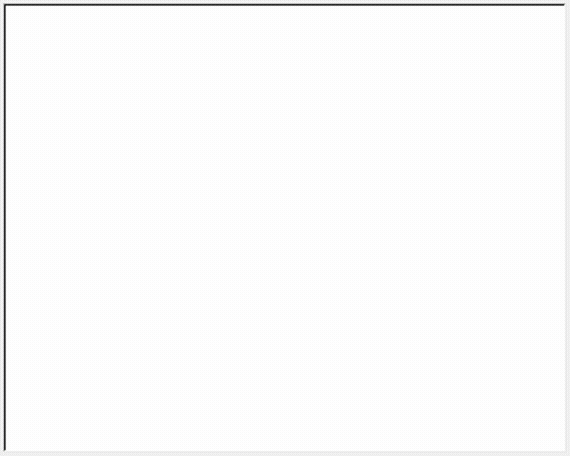

## Day 19

Today we continue using turtle grapihics while learning about event listeners, higher order functions, states and multiple instances of an object.
The day's project was building a turtle racing game.

## Turtle Race

