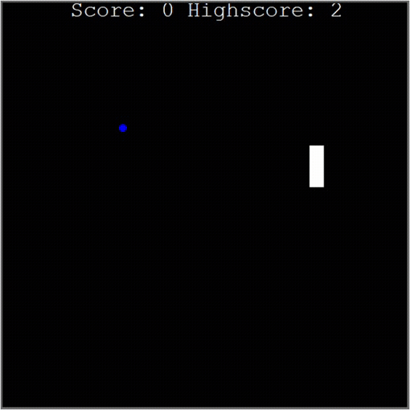
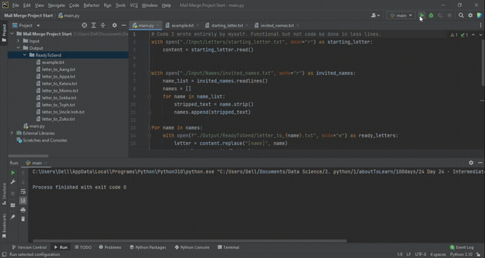

## Day 24

Files, Directories and Paths
Day 24 was about learning how to access files using either absolute or relative paths in python. With this learnt,  the snake game of day 21 is able to keep high scores.
A mail merge program was written that is able to create new letters using a starting letter in a text file and changing the names from existing names on another text file.
I was able to wrote this entirely myself even those it could have been done in fewer lines.

## Snake

## Mail merge

