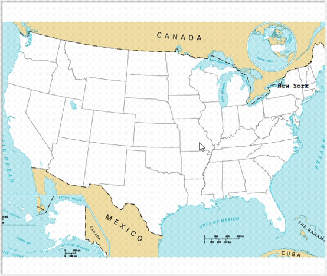

## Day 25

Working with CSV Data and the Pandas Library
Today we started learning how to read and manipulate csv file types using the pandas library.
The day's project was making a game where you try to name all the states in the US.

## U.S. States Game

