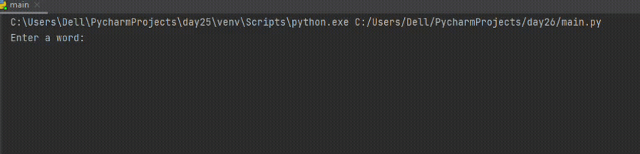

## Day 26

List Comprehension and the NATO Alphabet
We learnt how to use list comprehension in today's lesson. This helps us create new lists when fewer lines of code.
The days project was using list comprehension to create a Nato alphabet from a word.

## NATO Alphabet

