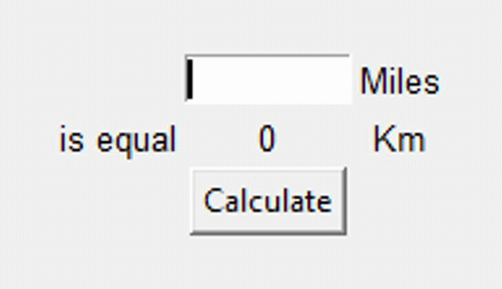

## Tkinter, _args, __kwargs and Creating GUI Programs

We started using Tkinter to create Gui applications. We also learnt about args and kwargs in functions.
With this, the day's project was create a Gui app that converts Miles to Kilometers.

## Miles To Kilometers

