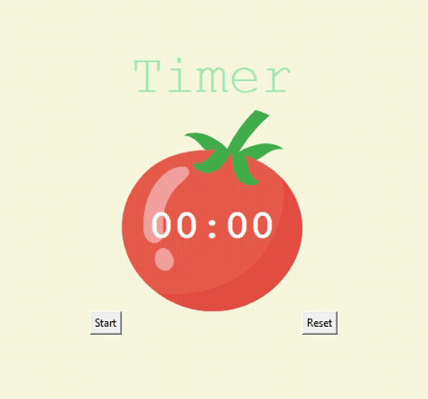

## Day 28

Tkinter, Dynamic Typing and the Pomodoro GUI Application
We continued learning about Tkinter and also learnt about Dynamic Typing in Python. 
The project was creating a GUI program that helps you time your pomodoro learning sessions.

## Pomodoro

