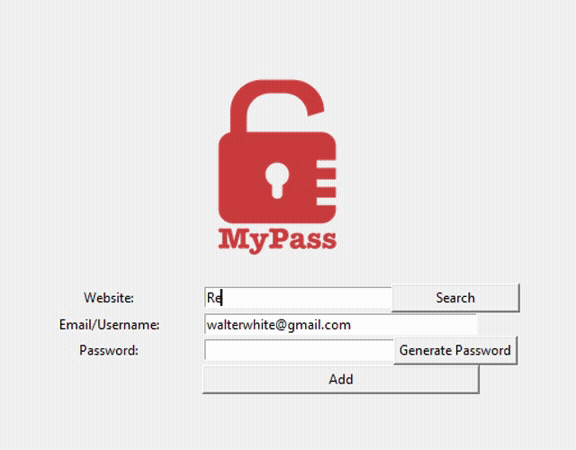

## Day 30

Errors, Exceptions and JSON Data. Improving the Password Manager
Today we leanrt about how to handle errors and exceptions that may occur in your code.
We also improved the passsword manager of yesterday by adding a search button thanks to the use of the json file format.

## Password Manager

